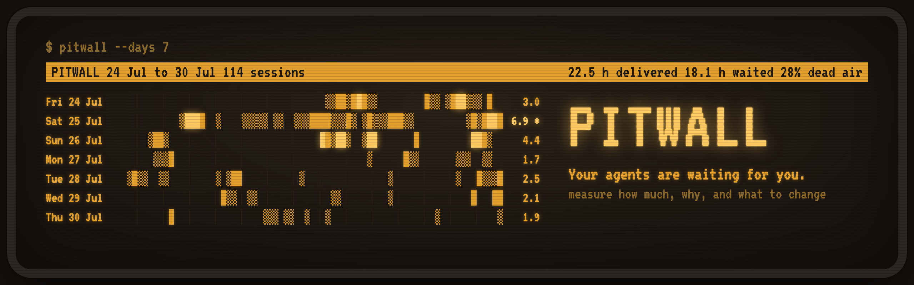
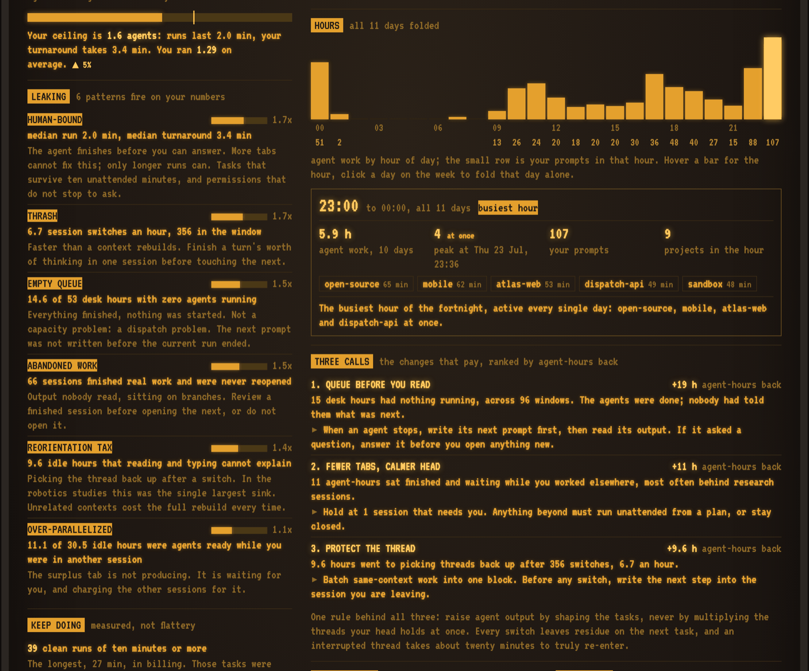
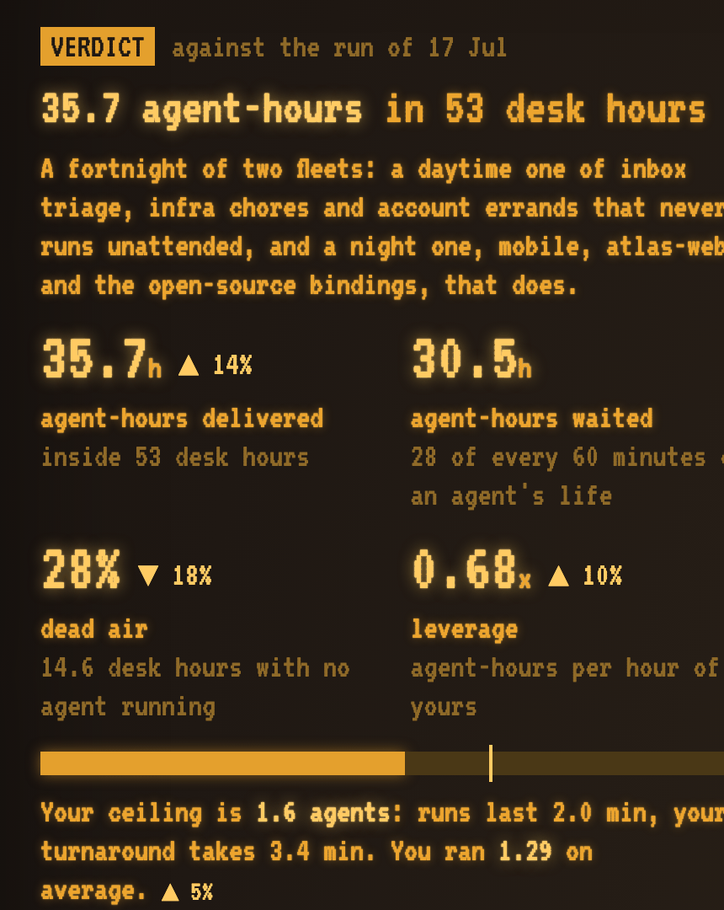
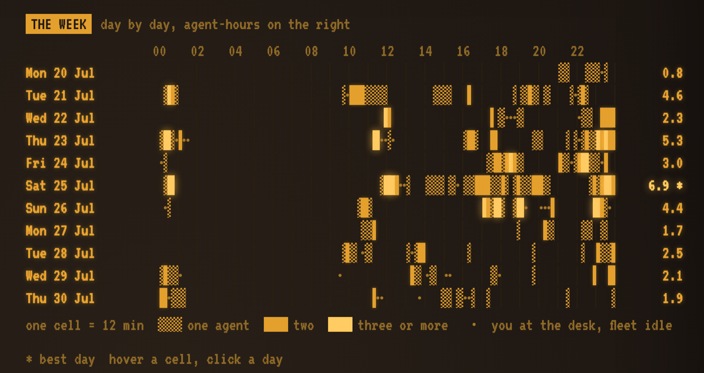
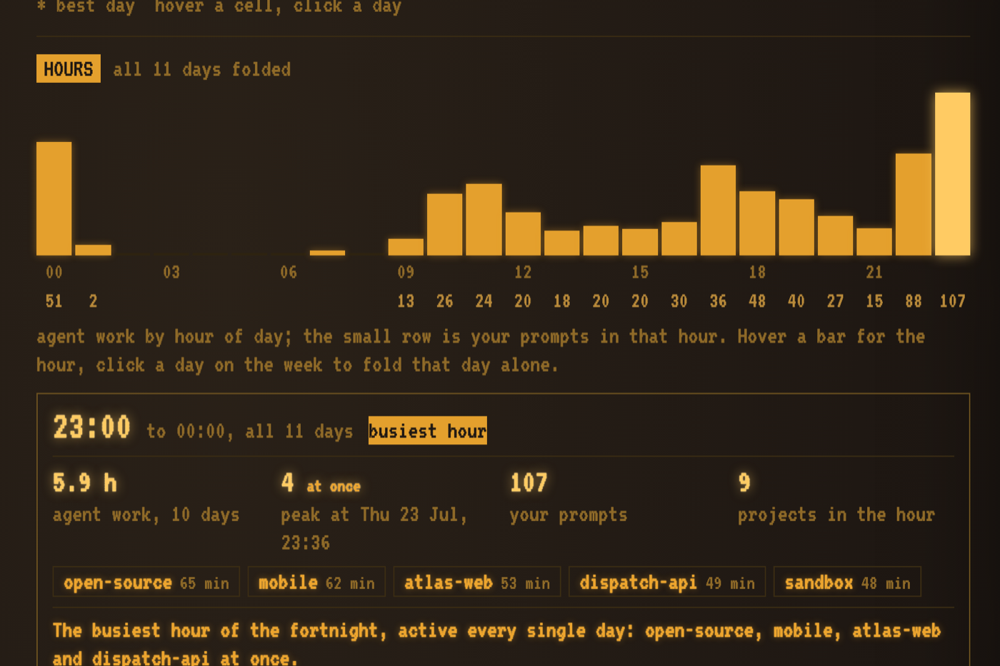
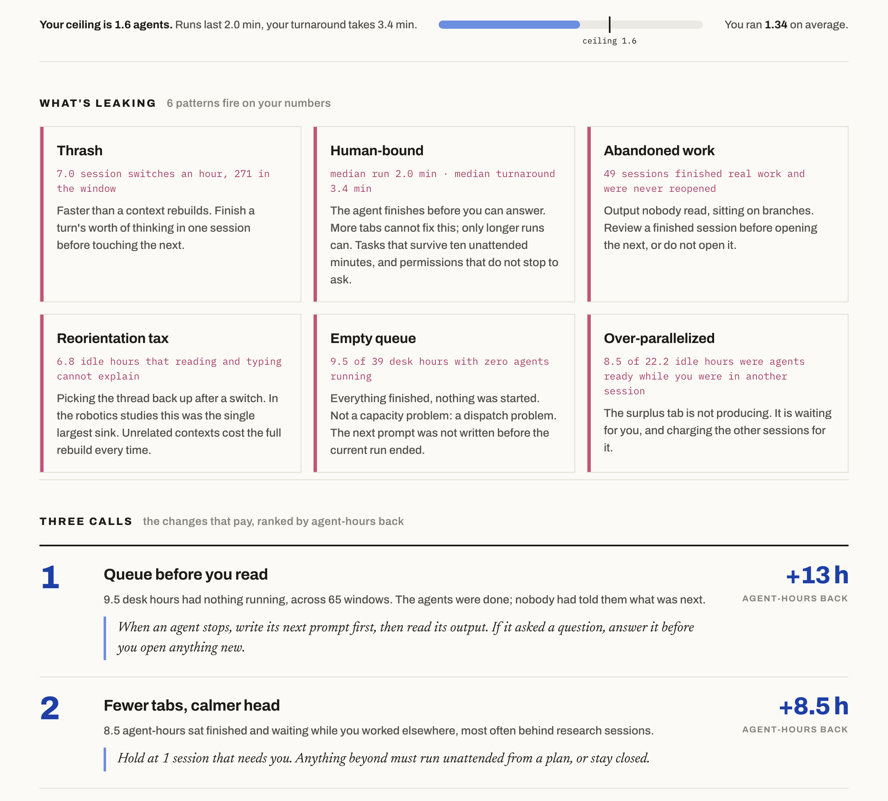

<p align="center"></p>

<p align="center"><strong>Your AI coding agents spend most of their life waiting for you.<br>Pitwall measures how much, why, and what to change.</strong></p>

<p align="center">
  <a href="LICENSE"></a>
  <a href="#install"></a>
  
  
</p>

<p align="center"></p>

Every usage tool answers "how many tokens did I burn". None answer the question that governs
throughput when you run several agents at once: **what share of your agents' time was spent
idle, waiting for a human to say the next thing, and which of your own habits caused it.**

Pitwall reads the session logs already on your disk, reconstructs when each agent was working,
when you were with it and when it sat idle, and hands you one screen: the verdict, the patterns
that fire on your numbers, the three changes that pay most, and the evidence behind them. It is
a skill for any coding agent: the agent runs the script, writes the summaries only a model can
write, and delivers the report.

## What you get

One amber terminal screen, built to be re-read every week. The full sample, a real fortnight
rendered as an invented person, is [`docs/sample-report.html`](docs/sample-report.html)
([open it in the browser](https://htmlpreview.github.io/?https://github.com/Maksim-Burtsev/pitwall/blob/master/docs/sample-report.html)).

**The left column is what to think about.**

<p align="center"></p>

- **The verdict.** One sentence written by the model, then four numbers: agent-hours delivered,
  agent-hours waited, dead air (desk time with nothing running), leverage (agent-hours per hour
  of yours). From the second run each carries its change against the previous one. Under them,
  your ceiling: how many agents you can keep fed, from your own measured pace.
- **What's leaking.** The failure patterns that fire on your numbers, each with its evidence and
  a bar for how far past the threshold it sits. Human-bound, empty queue, over-parallelized,
  reorientation tax, thrash, abandoned work.
- **Keep doing.** Measured strengths: clean unattended runs, single-agent focus, the tightest
  project. The pattern to copy on bad days.

**The right column is what happened.**

<p align="center"></p>

- **The week, day by day.** One cell is twelve minutes. Hatched is one agent, solid is two,
  bright is three or more, a dot is you at the desk with the fleet idle. Hover a cell for who ran;
  hover an idle stretch for why nothing did. Click a day to fold the hours onto it.

<p align="center"></p>

- **Hours.** Agent work by hour of day, all days folded or a single one. Hover a bar and the hour
  card opens: agent work, deepest parallelism and when, your prompts, the projects or sessions
  that ran, and the model's note on how that hour of the day tends to go.

<p align="center"></p>

- **Three calls.** The changes ranked by agent-hours returned, each as a rule you can apply on
  Monday, with the hours it buys.
- **By task kind, by project.** Where the turnaround is slowest, where the attention was spent
  best.

The verdict, the day lines and the hour notes are written by the model running the skill. Run
the script by hand and the report simply has none.

The terminal summary is four lines:

```
~/.claude/pitwall/report.html
  114 sessions, 585 prompts, 14d window
  your day 52.9h  |  agent-hours: 35.7 working, 30.5 waiting  |  dead air 14.6h
  NT=2.0m IT=3.4m -> fan-out potential 1.6, actual 1.29
```

Two clocks, never mixed. **Wall clock** is your day and can never exceed it. **Agent-hours** run
in parallel, so 36 of them fit inside 53 hours of yours. The last line is the ceiling: runs last
2.0 minutes, your turn takes 3.4, so one person keeps 1.6 agents fed. Opening a fifth terminal
tab cannot move that; the constraint is task shape, not tab count.

## Install

```
npx skills add Maksim-Burtsev/pitwall
```

That installs the skill into every agent harness it finds on the machine. Then ask your agent
"how am I doing with agents", or invoke `/pitwall`, optionally with a number of days
(`/pitwall 14`). Default is the last 7 full days before today, maximum 30.

<details>
<summary><strong>Claude Code</strong>, as a plugin</summary>

```
/plugin marketplace add Maksim-Burtsev/pitwall
/plugin install pitwall@pitwall
```

Or for one session without installing: `claude --plugin-dir path/to/pitwall`.

</details>

<details>
<summary><strong>Codex · Cursor · Gemini CLI · Copilot · OpenCode · Amp · Zed · Cline · Pi · Kiro · Windsurf · Goose</strong></summary>

```
npx skills add Maksim-Burtsev/pitwall -a codex     # or cursor, gemini-cli, copilot, ...
```

Or by hand: the skill is one self-contained directory.

```
cp -r skills/pitwall .agents/skills/
```

</details>

<details>
<summary><strong>Without an agent</strong></summary>

```
python3 skills/pitwall/pitwall.py            # writes ~/.claude/pitwall/report.html
python3 skills/pitwall/pitwall.py --days 14 --json
```

Python 3, standard library only. No dependencies, no network, no telemetry.

</details>

Put it on a weekly schedule and the report becomes a scoreboard: every render appends its
headline numbers to `~/.claude/pitwall/history.jsonl`, and the next one shows the change.

## Where the logs come from

Pitwall reads Claude Code's session logs, one JSONL file per session under `~/.claude/projects/`.
Other harnesses can run the skill, but the logs it reads are Claude Code's. Point it elsewhere
with `--root`.

## The model

Borrowed from human supervisory control of multiple robots, which has studied "how many
machines can one operator run" since long before coding agents existed.

**Fan-out**, Olsen & Goodrich, *Fan-out: measuring human control of multiple robots* (CHI 2004):

    FO = 1 + NT / IT

`NT` (neglect time) is how long a machine runs unattended; `IT` (interaction time) is how long
the human must attend to it. Here `NT` is the median uninterrupted agent run and `IT` is the
median gap from the agent stopping to your next prompt.

**Wait times**, Cummings & Mitchell, *Predicting Controller Capacity in Supervisory Control of
Multiple UAVs* (IEEE SMC-A, 2008). Raw fan-out overestimates, because idle time has causes:

| Bucket | Meaning |
|---|---|
| **WTI** | you were reading the output and writing the reply: unavoidable |
| **WTQ** | the agent was ready; you were in another session: the cost of parallelism |
| **WTSA** | idle beyond what reading and typing explains: the cost of losing the thread |

In the original study WTSA was the largest sink, cutting operator capacity by over a third even
under heavy automation. It is the formal version of what everyone notices: switching between
unrelated agent sessions costs far more than it looks.

The advice in the report leans on two more results about knowledge work in general: attention
residue (Leroy, *Why is it so hard to do my work?*, OBHDP 2009) and the cost of interrupted work
(Mark, Gudith & Klocke, CHI 2008). They set the direction of the advice, not its decimals.

## How the measurement works

- **Agent working**: a contiguous run of session events no more than 120 s apart, containing at
  least one assistant message (98.5% of real intra-run gaps fall under 120 s).
- **Human prompt**: a user record with `origin.kind == "human"`. Task notifications and tool
  results are not people.
- **Idle**: from the end of a work run to the next human prompt in that session.
- **Away**: an idle gap over 20 minutes is dropped, not counted. You went to lunch; that is not
  the agent starving.
- **Dead air**: time inside your working day when no agent was running at all.
- **Ignored entirely**: sessions with no human prompt. SDK runs and subagents had no supervisor.

`WTI` is estimated from how much there was to read and how much you wrote (about 1500 characters
read and 200 typed per minute), a calibrated guess. Everything else is measured from timestamps.
The task kinds (build, research, fix, ops, talk) come from a coarse tool-mix heuristic.

## Why it looks like this

One phosphor, four intensities. Dim is a label, plain is text, bright is a number that decides
something, reverse video is a header or an alarm. There is no colour to decode and nothing to
match against a legend except the texture of a cell. The charts are CSS grids, so they stretch
to any screen and never drift by a cell. The report is one static HTML file with no dependencies
beyond a font; it opens from disk, and it prints.

## Options

```
--days N       full days before today to analyze (default 7, max 30)
--today        include today
--out PATH     where to write the HTML (default ~/.claude/pitwall/report.html)
--json         print the metrics to stdout instead of rendering
--notes PATH   JSON of model-written summaries: {"week": "...", "days": {...}, "hours": {...}}
--no-titles    drop session titles (your own prompt text) from the report
--root PATH    session log directory (default ~/.claude/projects)
```

## Privacy

Nothing leaves the machine. Prompt text is read only to label a session with the first 46
characters of its opening prompt; render with `--no-titles` for a report you intend to share.
The sample in `docs/` is a real fortnight with every project, title, id and date replaced, so the
numbers are honest and the person is not.

## License

MIT
